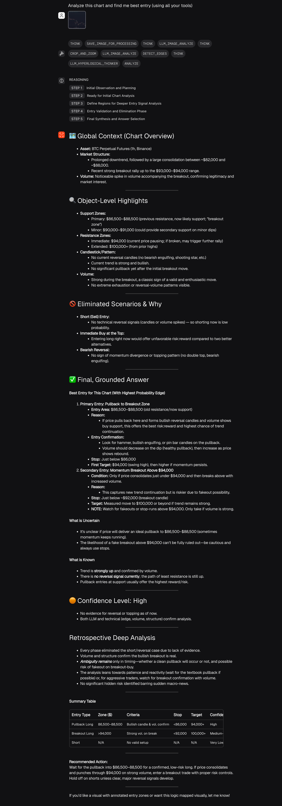
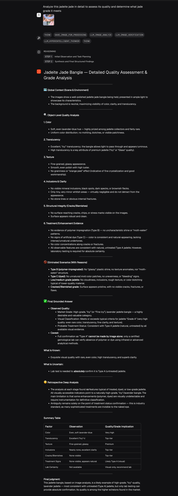
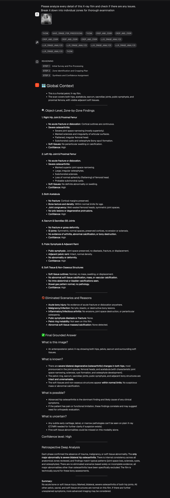
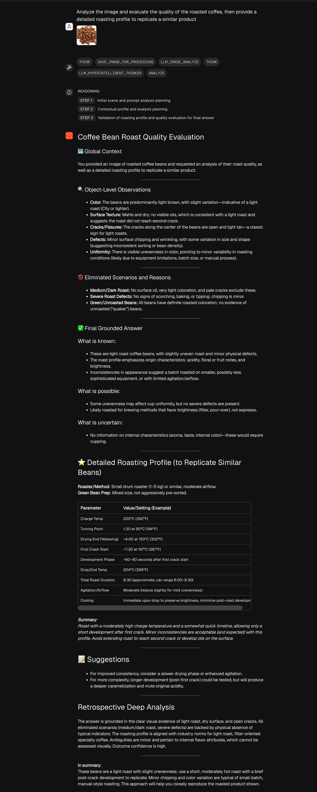
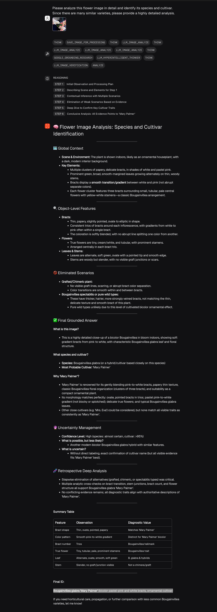
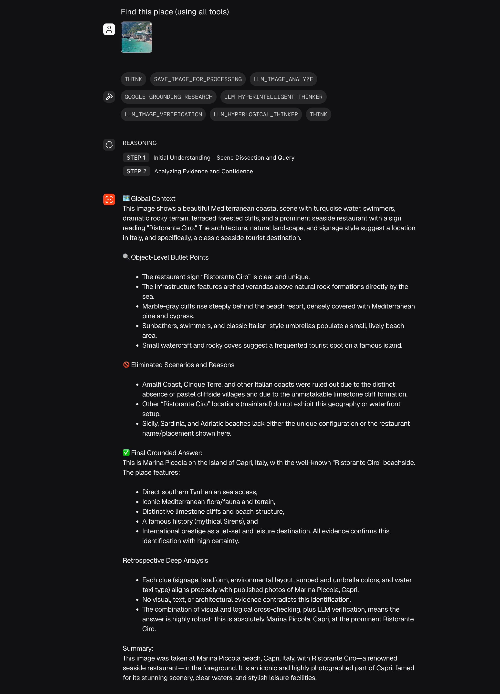

# Hyper Reasoning Agent

[](https://github.com/hyperzero-io/hyper-reasoning-agent)

Hyper-Reasoning-Agent is a multi-modal AI system built on [Agno](https://github.com/agnos-ai/agno), inspired by O3, and designed for advanced, explainable, image-grounded insights. By integrating leading LLMs and vision models, it delivers robust, high-certainty reasoning for demanding tasks.

## Core Capabilities

- **Vision Reasoning (GPT-4.1):** Performs deep, visual-first analysis of images, leveraging the GPT-4.1 model to ground all inferences in visual evidence before considering textual input.
- **Hyper-Intelligent Thinking (GPT-4.5):** Utilizes the GPT-4.5 model for creative, context-rich, and insightful reasoning, synthesizing information across modalities for advanced problem-solving.
- **Hyper-Logical Reasoning (o4-mini):** Employs the o4-mini model to deliver rigorous, step-by-step logical analysis, ensuring transparent and systematic evaluation of hypotheses.

## Features
- **Visual-First Reasoning:** Analyzes images before text, grounding all answers in visual evidence.
- **Multi-Model Integration:** Combines OpenAI, Gemini, and other LLMs for robust, cross-validated answers.
- **Modular Toolkits:** Includes image processing, annotation, and online research tools.
- **Explainable Output:** Produces step-by-step, transparent reasoning and confidence levels.
- **Configurable & Extensible:** All API keys and model settings are managed via `.env` and `config.py`.

## Setup

### 1. Clone the Repository
```bash
git clone https://github.com/hyperzero-io/hyper-reasoning-agent.git
cd hyper-reasoning-agent
```

### 2. Install Dependencies
```bash
pip install -r requirements.txt
```

### 3. Configure Environment Variables
Create a `.env` file in the project root (already provided as a template):

```
# Gemini API Key
GEMINI_API_KEY=your_gemini_api_key_here

# OpenAI API Key and Model Config
OPENAI_API_KEY=your_openai_api_key_here
OPENAI_BASE_URL=https://api.openai.com/v1
OPENAI_MODEL_GPT4=gpt-4.1-2025-04-14
OPENAI_MODEL_GPT45=gpt-4.5-preview-2025-02-27
OPENAI_MODEL_O4MINI=o4-mini-2025-04-16
```

### 4. Run the Agent
```bash
python playground.py
```

## Usage
- Upload images and ask questions via the provided playground interface.
- The agent will analyze the image, reason through multiple hypotheses, and provide a detailed, explainable answer with confidence levels and cited sources.

## Project Structure
- `playground.py` — Main entry point and agent logic
- `config.py` — Centralized configuration (reads from `.env`)
- `requirements.txt` — Python dependencies
- `saved_images/` — Stores processed and uploaded images

## License
MIT (or specify your license here)

## Acknowledgements
- Built on [Agno](https://github.com/agnos-ai/agno)
- Inspired by O3 and the latest advances in multi-modal AI 

## Examples

| Example                     | Description                                                                                                   | Screenshot                                      |
|-----------------------------|---------------------------------------------------------------------------------------------------------------|-------------------------------------------------|
| Trading Using Chart Image   | Analyze a financial chart image to extract trends, identify patterns, and provide actionable trading insights grounded in visual evidence. | [](screenshots/trading.png) |
| Jadeite Jade Analysis      | Perform detailed visual analysis of a jadeite jade specimen, identifying quality indicators, inclusions, and authenticity markers using advanced vision reasoning. | [](screenshots/jadeite_jade_analyze.png) |
| X-ray Image Analysis      | Conduct comprehensive analysis of X-ray images to detect anomalies, interpret medical findings, and support diagnostic decisions with explainable, image-grounded reasoning. | [](screenshots/x-ray-analyze.png) |
| Coffee Bean Roasting Analysis | Assess the roast level, uniformity, and quality of coffee beans from an image, providing expert evaluation and actionable recommendations for optimal roasting. | [](screenshots/coffee_roasted_analyze.png) |
| Flower Finder and Analysis | Identify flower species and analyze botanical features from an image, delivering detailed classification and insights using advanced visual reasoning. | [](screenshots/flower_finder_and_analyze.png) |
| Location Finder Using Image | Determine the geographic location or context from an image by analyzing visual cues, landmarks, and environmental features, providing precise and explainable geolocation insights. | [](screenshots/location_finder_using_image.png) |

*Click the thumbnail to view the full screenshot.* 